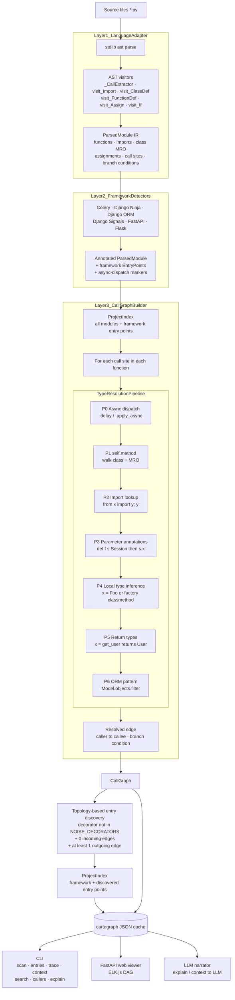

# Cartograph

[](https://github.com/sashu2310/cartograph/actions/workflows/ci.yml)
[](https://pypi.org/project/cartograph-code/)
[](https://opensource.org/licenses/MIT)

Static analysis for Python codebases. Discovers entry points, builds cross-file call graphs, outputs structured context for LLMs.

```bash
pip install cartograph-code
carto scan ./sentry/src
```

```
Scan complete.
  4,415 modules · 30,926 functions · 788 entry points · 37,659 resolved calls

Discovered Flows:

   1. issues (142 entry points: 89 discovered, 53 signal_handler)
      Deepest: process_organization_mapping → 22 functions

   2. integrations (98 entry points: 98 discovered)
      Deepest: setup_intent_succeeded → 18 functions

   3. monitors (67 entry points: 67 discovered)
      Deepest: _process_checkin → 57 functions
   ...
```

Sentry uses `@instrumented_task` and `@cell_silo_endpoint` — custom decorators no static analyzer has seen before. Cartograph found 788 entry points without a single line of Sentry-specific code.

---

## Walkthrough

**1. Scan** — parse the codebase, discover entry points, group by domain.


**2. Entries** — list every entry point, filter by type.


**3. Trace** — walk the call graph from any function, with branch conditions on edges.


**4. Context** — collapse the whole codebase into a structured markdown page for LLMs.


**5. Pipe to Claude** — the payoff: ask your LLM about any flow with full graph context.


---

## How It Works



### Entry Point Discovery

Most code analysis tools hardcode decorator names: "if you see `@app.get`, it's a route." This breaks the moment a codebase uses custom wrappers.

Cartograph takes a different approach. After building the call graph, it looks at the graph topology:

**A function is an entry point if:**
1. Zero incoming edges — no project code calls it
2. Has outgoing edges — it does something
3. Has a decorator — a framework registered it

This works on any framework, any custom decorator, without configuration. Framework detectors (FastAPI, Flask, Django, Celery) still exist — they add rich labels like "GET /api/users" — but they're optional. The topology does the discovery.

| Codebase | Detector-only | + Topology | Notes |
|----------|-------------|-----------|-------|
| Sentry | 52 | 788 | `@instrumented_task`, `@cell_silo_endpoint` |
| Dagster | 0 | 255 | `@public`, `@job_cli.command` — zero detectors exist |
| Polar | 328 | 600 | FastAPI routes + `@actor`, `@cli.command` |
| Prefect | 183 | 396 | FastAPI routes + `@flow`, `@task` |

### Type Resolution

Resolving `receiver.method()` requires knowing the type of `receiver`. The pipeline tries these sources in order:

1. **self + MRO** — `self.method()` walks the class hierarchy
2. **Imports** — `from .service import user_service; user_service.get()`
3. **Parameter annotations** — `def f(session: AsyncSession): session.execute()`
4. **Local assignments** — `x = Foo()` or `x = Foo.create_delegation()` (factory classmethods)
5. **Return types** — `x = get_user()` where `get_user() -> User`
6. **ORM patterns** — `Model.objects.filter()`

The factory classmethod resolution is why Sentry works. Sentry's service layer: `action_service = ActionService.create_delegation()` — 36 service singletons, all using this pattern. Without recognizing that `Foo.create_delegation()` returns type `Foo`, every service call resolves to nothing.

### Conditional Branches

Call edges carry their condition. When `get_claim_info` calls `ResourceNotFound` three times under different conditions, the graph preserves each one:

```
get_claim_info → ResourceNotFound  [condition: not seat]
get_claim_info → ResourceNotFound  [condition: else]
get_claim_info → ResourceNotFound  [condition: not organization]
```

### Cache

`carto scan` parses everything and writes to `.cartograph/` (JSON). Every subsequent command reads from cache. On Sentry (30K functions): first scan ~30s, every command after <0.5s.

---

## Commands

```bash
carto scan ./project              # parse + cache + show flows
carto entries                     # list entry points (no path needed after scan)
carto entries --type api_route    # filter by type
carto search "checkout"           # find functions by name
carto trace "deploy" --depth 3    # call tree with branches
carto callers "execute_run"       # reverse lookup
carto summary                     # stats
```

### Pipe to LLMs

`carto context` outputs structured markdown to stdout. Pipe it to whatever LLM you already use:

```bash
carto context | claude "what does this codebase do"
carto context "deploy" | claude "explain the deploy flow"
carto context "checkout" | gh copilot explain
```

Prefect's raw codebase: ~9M tokens. `carto context` output: ~8K tokens. The LLM gets every entry point, domain grouping, top callers, and package structure in one page.

### Built-in LLM (optional)

```bash
export CARTOGRAPH_LLM_PROVIDER=claude   # or openai, ollama
export ANTHROPIC_API_KEY=sk-ant-...     # or OPENAI_API_KEY
carto explain                           # whole codebase
carto explain "checkout"                # specific flow
```

### Web Viewer

```bash
carto serve ./project --port 3333
```

ELK.js layout engine, draggable nodes, branch visualization on edges, condition labels. Click any entry point to render its DAG.

---

## Tested Against

| Project | Framework | Functions | Entry Points | Resolved Edges |
|---------|-----------|-----------|-------------|----------------|
| Sentry | Django + Celery (custom) | 30,926 | 788 | 37,659 |
| Polar | FastAPI | 6,350 | 600 | 6,327 |
| Prefect | FastAPI + custom | 6,280 | 396 | 2,821 |
| Dagster | Custom framework | 11,533 | 255 | 6,919 |
| paperless-ngx | Django + Celery | 1,559 | 26 | 1,099 |

122 tests passing.

---

## Design Decisions

**Why stdlib `ast` instead of tree-sitter?** Python-only for now. `ast` gives us the full parse tree with zero dependencies. Tree-sitter is the migration path for multi-language support.

**Why topology for entry points?** Because hardcoding `@app.get` means maintaining a list that's always incomplete. The graph already knows which functions are roots. Use the structure, not the annotations.

**Why not use LSP?** LSP requires a running language server and gives you one symbol at a time. We need the whole graph at once for topology analysis. Different tool for a different job.

**Why pipe instead of built-in LLM?** Developers already have their LLM. We're a context generator, not an LLM wrapper. The built-in `explain` command exists for convenience, but `carto context | claude` is the primary workflow.

**Resolution ceiling:** ~65% of project-internal calls resolve on complex codebases. The remaining are calls to external packages (Django ORM, stdlib, sentry_sdk) that no project-level static analyzer can resolve. The entry point discovery doesn't depend on resolution — it's pure graph topology.

### Blast Radius

```bash
cartograph blast /path/to/project                               # from git diff HEAD
cartograph blast /path/to/project --file foo/bar.py             # explicit file(s)
cartograph blast /path/to/project --function pkg.module.fn      # explicit function
cartograph blast /path/to/project -d 5 --format markdown        # markdown for PR comments
cartograph blast /path/to/project --format json -o blast.json   # machine-readable
```

---

## Roadmap

- **Blast radius** — `cartograph blast` is now available (see Commands above)
- **MCP server** — Cartograph as a tool for Claude Code / Cursor (no piping needed)
- **Tree-sitter** → Java (Spring Boot), Go, TypeScript
- **CI integration** — GitHub Action that comments blast radius on PRs

---

## License

MIT

*LLMs guess. Cartograph proves.*
