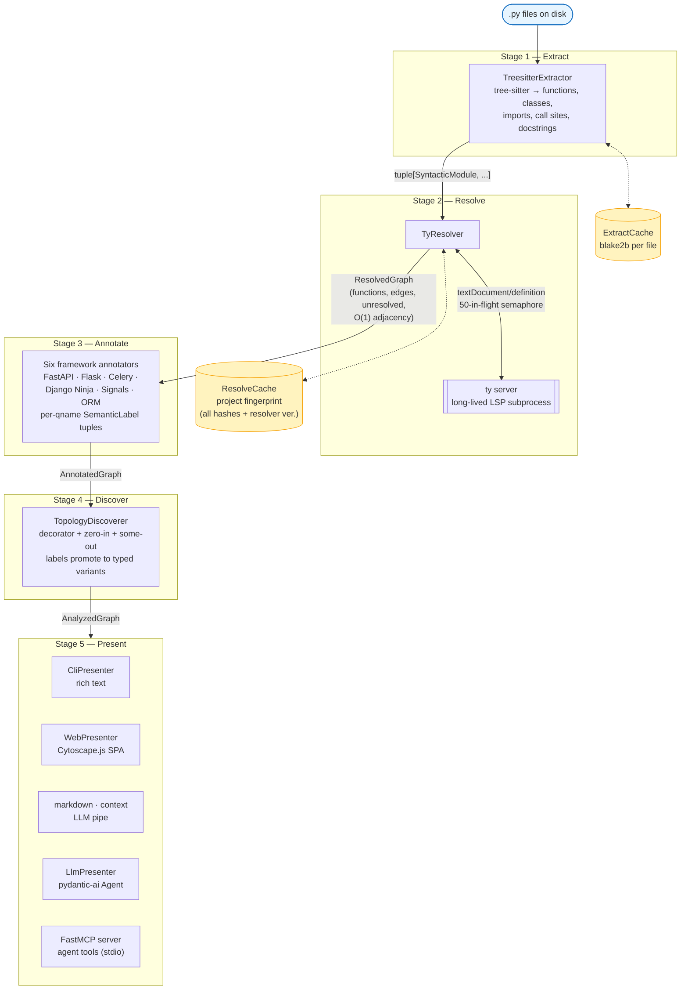

# Cartograph v2 — High-Level Design

**Harnessing deterministic context for LLMs.**

Navigation document. Read this to orient in the codebase in one sitting, or to prime an LLM for v2 questions. The product thesis lives in [`architecture.md`](./architecture.md); this doc is the map.

## One-line summary

A 5-stage async pipeline that turns a Python project into a call graph — content-hash cached at every stage, resolution delegated to `ty` over LSP, rendered for CLI / web / LLM / MCP consumption.

## Data flow, start to finish

## Module map (where each concern lives)

### Entry + orchestration
- `cartograph/v2/cli.py` — Click CLI. Wires the pipeline per-command. Qname resolution + last-project-path.
- `cartograph/v2/pipeline.py` — `Pipeline` frozen dataclass. `build()` runs stages 1-4. `run()` builds + renders.
- `cartograph/v2/config.py` — `RunConfig` (project_root, include_tests, use_cache, exclude_dirs).

### IRs (frozen pydantic)
- `cartograph/v2/ir/base.py` — `IR` base (frozen + extra=forbid + strict), `Ok`/`Err_`/`Result`, `TypeGuard`s.
- `cartograph/v2/ir/errors.py` — `ExtractError`, `ResolverError`, `PipelineError` variants.
- `cartograph/v2/ir/syntactic.py` — Stage 1. `SyntacticModule`, `SyntacticFunction`, `DecoratorSpec`, `CallKind` union (`PlainCall` / `MethodCall` / `AsyncDispatchCall` / `AsyncOrchestrationCall`).
- `cartograph/v2/ir/resolved.py` — Stage 2. `FunctionRef`, `Edge` (with `async_kind`), `UnresolvedCall` union, `ResolvedGraph` with O(1) indexes.
- `cartograph/v2/ir/annotated.py` — Stage 3. `SemanticLabel` union (`ApiRouteLabel`, `CeleryTaskLabel`, `CeleryBeatLabel`, `DjangoSignalLabel`, `OrmOperationLabel`), `AnnotatedGraph`.
- `cartograph/v2/ir/analyzed.py` — Stage 4. `EntryPoint` union (`DiscoveredEntry`, `ApiRouteEntry`, `CeleryTaskEntry`, `SignalHandlerEntry`), `AnalyzedGraph`.
- `cartograph/v2/ir/common.py` — `CommonGraph` (benchmarking IR).

### Stage implementations
- `cartograph/v2/stages/extract/` — `protocol.py` + `treesitter_extractor.py` (tree-sitter visitor).
- `cartograph/v2/stages/resolve/` — `protocol.py`, `ty_resolver.py` (main), `lsp/` (JSON-RPC transport, client, server, subprocess).
- `cartograph/v2/stages/annotate/` — `protocol.py`, `registry.py`, six framework files in `frameworks/`.
- `cartograph/v2/stages/discover/` — `protocol.py`, `topology.py`.
- `cartograph/v2/stages/present/` — `protocol.py`, `cli.py`, `web.py` (FastAPI), `web_serializers.py`, `llm.py` (pydantic-ai Agent), `markdown.py` (deterministic markdown for LLM context).

### Agent-native distribution
- `cartograph/v2/mcp/server.py` — FastMCP server exposing `scan`, `entries`, `trace`, `callers`, `search`, `context`, `analyze` as agent-callable tools. Graph is built lazily + cached per server lifetime. Reached via `carto2 mcp <path>` on stdio.

### Caching
- `cartograph/v2/cache/store.py` — `ExtractCache`, `ResolveCache`, `content_hash`, `project_fingerprint`, `_atomic_write`.

### Web viewer
- `cartograph/v2/web/static/index.html` — Cytoscape.js + dagre SPA. Served by `stages/present/web.py`.

### Benchmarking
- `cartograph/v2/benchmark/runner.py` — `run_v1`, `run_v2_ty`, `run_target`.
- `cartograph/v2/benchmark/metrics.py` — `compare()`, `ComparisonReport` (Jaccard + corroboration rates).
- `cartograph/v2/benchmark/adapters/` — v1/v2 → `CommonGraph` converters.

## Protocol contracts

All stages return typed `Result`. Fallibility is explicit at the boundary.

| Protocol | Shape |
|---|---|
| `Extractor` | `(path, module_name) -> Result[SyntacticModule, ExtractError]` |
| `Resolver` | `async (modules, project_root) -> Result[ResolvedGraph, ResolverError]`, plus `.name` and `.version` |
| `Annotator` | `(graph, modules) -> dict[qname, tuple[SemanticLabel, ...]]`, plus `.framework` |
| `Discoverer` | `(graph) -> tuple[EntryPoint, ...]` |
| `Presenter` | `(graph, options) -> bytes`, plus `.output_format` |

## Where to look, by concern

| If you need to… | Look at |
|---|---|
| Add a framework | `cartograph/v2/stages/annotate/frameworks/` + add label variant to `ir/annotated.py` + register in `annotate/registry.py` |
| Swap the resolver | Implement `Resolver` protocol, reuse `stages/resolve/lsp/` transport |
| Add a new output format | Implement `Presenter` protocol in `stages/present/` |
| Change graph shape | Touch one IR at `ir/{syntactic,resolved,annotated,analyzed}.py`. Downstream uses narrow by pydantic discrimination. |
| Add a CLI command | `cli.py` — click command decorator + `_resolve_path()` + `_require_qname()` for qname args |
| Tune LSP concurrency | `stages/resolve/lsp/client.py` — `DEFAULT_CONCURRENCY` |
| Debug pipeline timing | Every stage emits `logfire.span(...)`. Set `LOGFIRE_SEND_TO_LOGFIRE=0` for stdout only. |

## Example: "carto2 trace checkout" — what actually happens

1. `cli.py::trace` is invoked. `_resolve_path(None)` reads `~/.cartograph/last_project_v2` if no path was passed.
2. `asyncio.run(_build_graph(path, include_tests=False))` — spawns `ty server` (async context manager), builds the pipeline, runs stages 1-4.
3. Stage 1 walks `.py` files under the project root. For each, checks `ExtractCache.get(content_hash(path))`. Miss → tree-sitter parse → `SyntacticModule` → `cache.put`. Hit → yield cached.
4. After Stage 1, `project_fingerprint(modules, resolver_version="ty@0.0.31")` is computed. `ResolveCache.get(key)` checked. Hit → skip Stage 2 entirely. Miss → `TyResolver.resolve()` walks every call site, queries LSP in async batches of 50.
5. Stages 3-4 run in-process (cheap). `AnalyzedGraph` returned.
6. `_require_qname(resolved.functions, "checkout")` — exact → unique suffix → substring. Resolves to `a.b.checkout` or errors with suggestions.
7. `_print_tree(resolved, qname, depth, indent=0, seen=set())` walks `resolved.get_callees(qname)` recursively, printing indented ASCII.
8. Process exits. LSP subprocess is terminated by `LspServer.__aexit__`.

## Caching semantics, end to end

| Event | Stage 1 cache | Stage 2 cache |
|---|---|---|
| First scan | Miss everywhere, populates `.cartograph/v2/extract/{hash}.json` per file | Miss, populates `.cartograph/v2/resolve/{fingerprint}.json` |
| Second scan, no change | Hit every file | Hit |
| One file edited | That file misses, re-parses | Fingerprint differs → full Stage 2 re-run |
| Resolver upgraded | All hit (file hashes unchanged) | Fingerprint differs (resolver version tag) → full re-run |
| Cache corrupt | `ValidationError → None` → treated as miss | Same — self-healing |
| Crash mid-write | `tmp + os.replace` → previous file intact; next load reads old or misses | Same |

## Performance shape

On fastapi (≈1400 functions, 500 edges):
- First scan cold: ~30–60s (LSP cold start dominates)
- Second scan, unchanged: <1s (both caches hit)
- One-file edit: ~2–5s (Stage 1 mostly cached, Stage 2 re-runs)

On cartograph v2 itself (≈400 functions):
- First scan: ~1.5s
- Cached rescan: <200ms

## Extension points, recap

Each box in the data-flow diagram is a `Protocol` implementation. Replace any one by constructing a new `Pipeline` with a different instance. `web_serializers.py` is called by `web.py`; the Cytoscape SPA talks to that shape via `/api/*`. Adding a new "analyses" layer (e.g., N+1 detection, hotspot ranking) is additive: consume `AnalyzedGraph` in `cartograph/v2/analyses/` and render via a new presenter or CLI subcommand.
