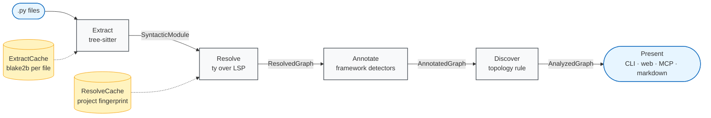
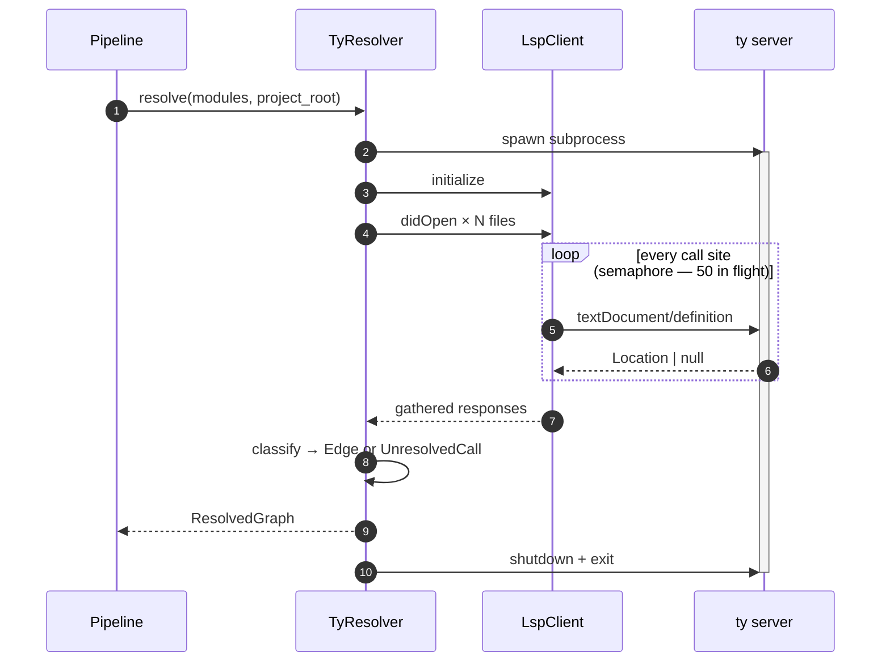

# Cartograph v2 — Architecture

Large language models read source code the same way a new engineer reads source code — one window at a time, guessing at cross-file behaviour from the bits of syntax they can see. The guesses are often wrong: an import's actual target, an entry point's trigger, whether a method call is a synchronous invocation or a Celery dispatch that runs in a different process. Cartograph is the counterpart we'd like probabilistic readers to have — a static analyser that produces ground-truth structure they can consume without inventing any. The product line is *harnessing deterministic context for LLMs*, and every design decision below flows from it.

v2 is a ground-up redesign of v1's pipeline in service of that line. This is the design record.

## Thesis

We don't own resolution. Call-site resolution is the algorithmically interesting phase of any static-analysis tool, and v1 hand-rolled it in ~600 lines of cascading heuristics (self-reference, MRO walk, import lookup, parameter types, return types, ORM patterns, async dispatch) that claimed "~65% accuracy" on no test fixture. v2 delegates to `ty` (Astral's Rust type checker) spawned as an LSP subprocess; everything this tool knows about Python types is what `ty` knows, which is everything, because that's what type checkers are for. Cutting the resolver dropped Stage 2 from ~600 LOC of heuristics to ~500 LOC of transport and shell.

The five inter-stage IRs (`SyntacticModule`, `ResolvedGraph`, `AnnotatedGraph`, `AnalyzedGraph`, `CommonGraph`) are all pydantic models with `frozen=True`, `extra="forbid"`, and `strict=True` — no late-arriving fields, no silent schema drift, no dict-as-API leaks between stages. Variant sets are discriminated unions; non-exhaustive matches fail type-check. Fallibility is `Result[T, E] = Ok[T] | Err_[E]` with `TypeGuard`-narrowed `is_ok` / `is_err`. The discipline is uncommon in Python, and the payoff is not aesthetic — it's that an LLM (or any downstream consumer) can reason about the schema without reading stage implementations.

The pipeline caches what actually costs. LSP resolution is 100–1,000 ms per thousand call sites; extraction is 10–50 ms per file. Both are content-hash cached (blake2b-256 of file bytes for Stage 1, a project-wide fingerprint for Stage 2). Rerunning `carto2` against an unchanged project hits both caches and returns in single-digit milliseconds. That cache is what makes the tool usable inside an agent loop.

Other Python call-graph tools exist — `pyan`, `pydeps`, pyright's graph dump, `code2flow`. None chain a type-checker-backed resolver with topology-based entry discovery and an agent-native distribution path. That composition is what v2 contributes.

## Pipeline

Five stages, each a pure function over a frozen IR:



| Stage | Input | Output | What happens |
|---|---|---|---|
| 1. Extract | `.py` files | `SyntacticModule` | Tree-sitter walks each file; emits call sites, functions, classes, imports, decorators, docstrings. |
| 2. Resolve | `tuple[SyntacticModule, ...]` | `ResolvedGraph` | `ty` over LSP resolves every call site. Edges carry `async_kind` for Celery dispatch semantics. |
| 3. Annotate | `ResolvedGraph` + modules | `AnnotatedGraph` | Six framework detectors (FastAPI, Flask, Celery, Django Ninja, Django Signals, Django ORM) emit `SemanticLabel`s. Per-call-site ORM labels carry line numbers. |
| 4. Discover | `AnnotatedGraph` | `AnalyzedGraph` | Topology rule (decorator + zero in-edges + ≥1 out-edge) surfaces entry points; labels promote generic entries into typed variants. |
| 5. Present | `AnalyzedGraph` | `bytes` / tool responses | CLI tree, Cytoscape.js SPA, markdown, pydantic-ai narrator, MCP tools. |

Side effects — subprocesses, file I/O, caches — are confined to stage implementations. The orchestrator (`pipeline.Pipeline`) holds no state beyond the stage instances themselves. Each stage is a `Protocol`; `TreesitterExtractor → AstExtractor` or `TyResolver → PyreflyResolver` is a constructor swap. We tried both during development and kept neither — `v1-vs-v2.md` has the post-mortem.

## Intermediate representations

| IR | Output of | Carries |
|---|---|---|
| `SyntacticModule` | Stage 1 | Functions (sync/async), classes, imports, call sites (discriminated: plain / method / async_dispatch / async_orchestration), docstrings |
| `ResolvedGraph` | Stage 2 | `functions: dict[qname, FunctionRef]`, `edges: tuple[Edge, ...]` (with `async_kind`), `unresolved: tuple[UnresolvedCall, ...]`, pre-computed O(1) adjacency indexes |
| `AnnotatedGraph` | Stage 3 | `ResolvedGraph` + `labels: dict[qname, tuple[SemanticLabel, ...]]` (per-call-site ORM, framework route info, etc.) |
| `AnalyzedGraph` | Stage 4 | `AnnotatedGraph` + `entry_points: tuple[EntryPoint, ...]` (discriminated union with per-kind metadata) |
| `CommonGraph` | Benchmark | Lossy shape shared between v1 and v2-ty for set-wise comparison |

IRs chain by embedding — `AnalyzedGraph` contains `AnnotatedGraph` contains `ResolvedGraph`. A Stage 5 presenter receives one object.

## Protocols

```python
class Extractor(Protocol):
    def extract(self, path, module_name) -> Result[SyntacticModule, ExtractError]: ...

class Resolver(Protocol):
    name: str
    version: str
    async def resolve(self, modules, project_root) -> Result[ResolvedGraph, ResolverError]: ...

class Annotator(Protocol):
    framework: str
    def annotate(self, graph, modules) -> dict[str, tuple[SemanticLabel, ...]]: ...

class Discoverer(Protocol):
    def discover(self, graph) -> tuple[EntryPoint, ...]: ...

class Presenter(Protocol):
    output_format: Literal["cli", "json", "html", "markdown", "mermaid", "dot"]
    def render(self, graph, options) -> bytes: ...
```

Each has ≥1 concrete implementation today. Adding another is file-local.

## Design decisions

Resolution is delegated, not owned. `ty server` spawns once per pipeline run and handles every call-site query; the `LspClient` correlates JSON-RPC responses through a 50-in-flight semaphore (hardcoded — a tunable would help on beefier hardware, but no one has asked). Cold start costs 1–3 s per run, and thousands of `textDocument/definition` queries amortise that easily. We benchmarked `pyrefly` head-to-head during development and cut it: 487 edges in 1.7 s under `ty` versus 12 edges in 98 s under `pyrefly` without project-specific config. The gap was too large to justify shipping both.



Stage boundaries enforce schemas. Every IR is a frozen pydantic model; adding a field after the fact breaks construction instead of failing silently downstream. Variant sets use discriminated unions with `Literal` tags, so a consumer that forgot to handle a case fails type-check instead of defaulting. We considered `dict[str, Any]` with type hints for v2 and rejected it inside a week — v1's "just a dict" IRs had become a bug factory three months in. The cost of strictness is one pydantic model per stage; the benefit is that an LLM consuming the output doesn't have to read stage implementations to know what's in the payload.

Per-call-site granularity is preserved through the pipeline. `OrmOperationLabel` carries a line number. `Edge.async_kind` tags Celery dispatch shape (`celery_delay`, `celery_apply_async`, `celery_chain`, `celery_chord`, `celery_group`); `None` means sync. Classes count as graph nodes — `FunctionRef.kind: Literal["function", "method", "class"]` — because `x = Foo()` resolves to the class, and omitting that costs 5–15% of edges on Django and pydantic-heavy codebases. v2 initially collapsed ORM labels to a per-function summary; we restored per-site granularity within a week after N+1 detection turned out to be hard to implement against the aggregate shape. Lesson: don't denormalise at the IR layer. Let views decide what to collapse.

Caching is content-addressed, two stages, JSON on disk. blake2b-256 keys (~2× faster than sha256 at the same 64-char hex length) hash file bytes at Stage 1; a project-wide fingerprint of sorted `(module_name, content_hash)` pairs plus the resolver version string keys Stage 2. Atomic writes via `tmp + os.replace`; malformed entries self-heal (`except ValidationError: None`). Disk format is JSON — not SQLite, not pickle, not a compressed blob. 10K entries fit a filesystem cleanly, and `cat` and `jq` are the debugger at 2 a.m. when a cache entry goes stale.

Distribution splits by audience. CLI with markdown piping is for humans and one-shot LLM calls. The MCP server (stdio) is for the agent ecosystem — one protocol covers Claude Code, Cursor, Zed, Continue, the OpenAI Agents SDK. Tools skew deterministic: `context` returns markdown facts, `trace` / `callers` / `search` return structured JSON. No `explain` tool is exposed. The agent already has an LLM; giving it another one is a round trip we don't want to encourage.

## Evaluation

Two producers, one project, structural overlap — no accuracy claim. v1 and v2 each emit a `CommonGraph` (the lossy shared IR); we compute pairwise Jaccard, shared-edge count, and producer-unique counts. The purpose is to measure *algorithmic divergence*, not correctness; neither producer is ground truth.

| Repo | .py files | v1 edges | v2 edges | v1 entries | v2 entries | Jaccard | shared | v1-only | v2-only | v1 time | v2 time |
|---|---:|---:|---:|---:|---:|---:|---:|---:|---:|---:|---:|
| celery  |   416 | 7,852 | 4,985 | 519 | 123 | 0.366 | 2,711 | 3,427 | 1,273 | 2.32s |  5.23s |
| fastapi | 1,119 |   608 |   487 | 466 |  52 | 0.660 |   346 |   148 |    30 | 0.55s |  0.10s† |
| prefect | 1,771 | 4,647 | 5,325 | 586 | 262 | 0.605 | 3,140 |   929 | 1,123 | 9.54s | 11.22s |
| django  | 2,900 | 7,885 | 5,881 | 173 | 107 | 0.524 | 3,968 | 2,747 |   851 | 3.27s |  7.33s |

† cache-hit; cold ~1.7s on the same repo.

Two observations worth stating, one neither producer's fault:

1. **Entry counts drop 3–9× under v2's stricter topology rule.** v1's framework detectors flag anything decorated with a known route decorator; v2 additionally requires the topology check (zero in-edges, ≥1 out-edge). On fastapi, v1 reports 466 entries (every `@app.get`); v2 reports 52 (routes that actually do work). The right number is not "more entries" — it's "entries that are actually reachable inputs to the system."

2. **Edge counts differ by codebase dynamism.** On well-typed codebases (fastapi, prefect), the producers converge (Jaccard 0.60–0.66). On dynamic codebases (celery, django), they diverge (0.37–0.52). v1 finds 3,427 edges in celery that v2 doesn't — most of these are heuristic guesses at method receivers that `ty` refuses to resolve. v2 finds 1,273 edges v1 doesn't — most are genuine cross-file resolutions v1's import-lookup pass misses. Neither is "wrong"; they're different answers to an under-specified question.

3. **Wall time.** v2 is typically 1.5–2× slower than v1 (except when ResolveCache hits, in which case v2 is 5–10× faster). The tax is LSP round-trips. We think this is the right trade.

## Trade-offs

| Kept | Traded away | Why |
|---|---|---|
| Whole-graph resolve cache | Per-module dependency DAG | At 1–10K files, whole-graph busts in ms. A DAG is code complexity you only feel at 50K+ files. |
| JSON disk format | SQLite / pickle / compressed blob | 10K entries fit the filesystem cleanly. SQLite is schema ceremony for no measurable gain; pickle loses inspectability. |
| Cytoscape.js + dagre (one lib) | ELK.js + D3 (two libs, v1's choice) | Fewer moving parts, built-in layout plugins (cose, dagre, fcose), native compound-node support for future module-grouping view. |
| Tree-sitter | Python `ast` | Tolerates partial syntax (keeps parsing after a broken function). Benchmark parity on well-formed code. |
| blake2b | sha256 | ~2× faster, same crypto strength, same 64-char hex length. |
| uv + PEP 621 + hatchling | Poetry | Astral's stack matches our resolver stack (ty is Astral). Single `pyproject.toml`, no separate lockfile format. |

## Scope & known limitations

**v2 does:**
- Function call graph with cross-file edges via `ty` over LSP.
- Topology discovery + six framework annotators (FastAPI, Flask, Celery, Django Ninja, Django Signals, Django ORM).
- Per-call-site ORM labels, async-kind-classified edges.
- CLI text, Cytoscape.js DAG viewer, pydantic-ai LLM narration, markdown for external LLMs.
- MCP server (stdio) exposing the pipeline to Claude Code / Cursor / Zed / any agent host.
- Two-stage cache; JSON output for scripting.
- Linux and macOS.

**v2 does not — and a reader evaluating whether to trust this tool should know:**
- **Own type inference.** Delegated to `ty`. Our graph is only as good as ty's resolution.
- **Resolve dynamic Python features.** `getattr(obj, name)()`, metaclass-driven dispatch, `dict[str, Callable]` lookups, and similar constructs land as `UnknownUnresolved` or `LspUnresolved`. We report them honestly; we do not heuristically resolve them. If you rely on runtime dispatch, edges will be missing.
- **Claim correctness.** The benchmark above is *pairwise divergence* between v1 and v2, not correctness against ground truth. We do not know our false-positive or false-negative rate.
- **Scale past ~50K files gracefully.** The Stage 2 cache invalidates the whole graph on any file change. At small-to-medium scale this is fine (ms to bust and repopulate); at monorepo scale it becomes the long pole.
- **Stay fully deterministic if you call `explain`.** The CLI `explain` command narrates a flow via an LLM, which introduces probability to an otherwise deterministic pipeline. The MCP server does not expose `explain` as a tool for exactly this reason.
- **Support Windows.** Linux + macOS only.
- **Parse non-Python sources.** `TreesitterExtractor` is positioned for it (Tree-sitter supports TypeScript, Go, Rust out of the box), but only Python is wired. Each additional language needs its own Resolver too.
- **Do per-module incremental resolve.** Whole-graph cache-bust at scale (see above).
- **Track per-function conditional branches.** Conditions sit on edges (`Edge.condition: str | None`). A per-function branch list was dropped as duplicate information.
- **Warm the LSP across sessions.** Cold start is 1–3s per `carto2` invocation. The MCP server keeps `ty` alive for its lifetime, which mitigates this inside an agent loop; one-shot CLI calls pay the tax every time.
- **Ship a rich analyses library.** Today's `analyses/` module has four rules (N+1, hotspots, mixed ops, async boundary crossings). It's a proof of concept that the frozen IRs support downstream static checks — not a general code-quality linter.

## File layout

Top-level packages under `cartograph/v2/`:

- **`cli.py`** — Click entry (`carto2`). Qname resolution, last-project path handling, rich rendering.
- **`pipeline.py`** — `Pipeline` frozen dataclass. `build()` runs stages 1–4; `run()` builds + renders.
- **`config.py`** — `RunConfig` (project root, include_tests, use_cache, exclude_dirs).
- **`cache/store.py`** — `ExtractCache`, `ResolveCache`, `content_hash`, `project_fingerprint`, atomic write helper.
- **`ir/`** — the five frozen pydantic IRs. `base.py` holds `IR`, `Result`, `TypeGuard`s; `syntactic.py` / `resolved.py` / `annotated.py` / `analyzed.py` are the stage outputs; `common.py` is the benchmark IR; `errors.py` is the error discriminated unions.
- **`stages/`** — one package per stage. `extract/` holds `TreesitterExtractor`; `resolve/` holds `TyResolver` plus the LSP client/server/subprocess transport; `annotate/` holds six framework annotators plus a registry; `discover/` holds `TopologyDiscoverer`; `present/` holds the CLI, web, markdown, LLM, and web-serializer presenters.
- **`mcp/`** — FastMCP server exposing seven tools (`scan`, `entries`, `trace`, `callers`, `search`, `context`, `analyze`) to agent hosts.
- **`web/static/index.html`** — Cytoscape.js single-page app, served by `stages/present/web.py`.
- **`benchmark/`** — runner, metrics (`compare`, Jaccard, corroboration), v1/v2 → `CommonGraph` adapters.
- **`analyses/`** — higher-order static checks (N+1, hotspots, mixed ops, async-boundary crossings) over `AnalyzedGraph`.

Tests live in `tests_v2/`, mirroring this layout.
